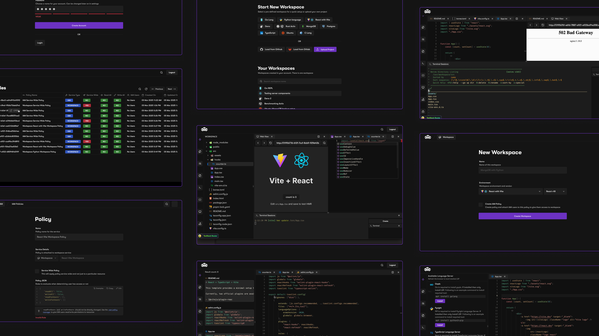

# Bones

An online collaborative coding workspace environment where teams can connect and write software together. This is like CodeSandbox and it has a rich code editor (intellisense like VSCode, terminal sessions, dynamic layout, file edit real time sync across connected users, and much more) along with user management and authorization policies (to restrict access to workspaces).



[Demo](https://www.youtube.com/watch?v=RG5bCvMIqtQ)

## Technologies used

**For frontend**:

- React w/ Vite, Tanstack Router
- TailwindCSS, Radix UI -- ShadCN UI
- React query w/ Orval, Zustand
- Vitest, Playwright, Storybook
- Monaco editor and related packages (for rich code editor features)
- Yjs with related packages (for real-time collaboration in file changes)
- Xterm with related packages (for terminals)
- React mosaic, React complex tree, Dnd kit

**For backend**:

- Hono.js and Node.js
- Drizzle and PostgreSQL
- Docker and Kubernetes
- Vitest

**For bridge v1**:

- Hono.js and Deno2
- VSCode Json Rpc, VSCode language server, and VSCode WS Json Rpc (for intellisense and other editor features)

**For bridge v2**:

- Express.js and Node.js
- Yjs-websockets (for collaboration)
- Node Pty (for terminal sessions)

**Deployment**:

Everything is deployed on AWS using Terraform. AWS ECR is used to store all the Docker images and then using Kubernetes config we can deploy frontend and backend with domains mappings which are supported by Route53 and Network Load Balancer (Nginx Ingress). Backend is horizontally scalable based on CPU/Memory utilization. Security is taken care private subnets, route tables, security groups, and IAM policies.

- Terraform
- AWS Elastic Kubernetes Service (EKS), access entry for restricting pod and K8s resource access
- AWS RDS and Elastic Cache
- AWS IAM roles and policies for security
- AWS Elastic Container Registry (ECR)
- AWS Secret Manager
- AWS IAM (users, groups, roles, policies), VPC, public and private subnets
- AWS EC2 (for build/pushing Docker images and DB migrations -- secured by IAM roles and policies)
- AWS Route53

## Bridge v1 vs v2

Bridge is responsible for connecting to the workspace from the frontend and we get the following features in the workspace:

- File system management (for managing file system under `/urs/workspace`)
- Real-time collaboration on file changes
- Terminal spawning and their management
- Intellisense and other editor features like we've in VSCode

In order to add new features to the workspace, which bridge service should be used, v1 or v2? Firstly research on the solution that will be implemented and see if it can be done in Hono and Deno (so bridge v1). Bridge v1 should be the first choice of implementing features, and only if it's not possible or implementation in Node and Express (i.e. bridge v2) is "x" times simpler then go for bridge v2.

**Bridge v1 handles the following features**:

- File system management (for managing file system under `/urs/workspace`)
- Intellisense and other editor features like we've in VSCode

**Bridge v2 handles the following features**:

- Real-time collaboration on file changes
- Terminal spawning and their management

## Setup

You would need Node.js, Pnpm, Docker/DockerDesktop and [Devbox](https://www.jetify.com/docs/devbox/installing_devbox/?install-method=macos).

Run the following commands to setup K8s cluster, load balancer for redirecting:

```bash
devbox shell # in the root of this project

cd ./tasks/setup-kind

# Generate KinD config
task kind:01-generate-config

# Setup KinD cluster i.e. K8s cluster
task kind:02-create-cluster 

# Setup Nginx load balancer
helm repo add ingress-nginx https://kubernetes.github.io/ingress-nginx
helm repo update
helm install nginx-ingress ingress-nginx/ingress-nginx \
  --namespace ingress-nginx \
  --create-namespace \
  --set controller.hostPort.enabled=true

# Enable load balancer services in KinD cluster
task kind:03-run-cloud-provider-kind

# Run K9s
# 1. Go to ingress-nginx namespace
# 2. Go to service and check the external IP address of the load balancer (This will be used in configuring the top level domain for routing traffic for workspace to this load balancer in our machine instead of going to the internet.)

# Setup DNS `.bones.test`
# Before running these commands go to `./tasks/setup-local-dns` folder, then open the `Taskfile.yaml` inside it and update `LOCAL_DNS_RESOLVER_IP` env variable with the external IP address of the load balancer; then run these commands:
cd ./tasks/setup-local-dns
task install
task nginx-ingress:setup
task test-dns # this will check if DNS changes are working as expected
```

Setup databases (can read more on this in `./backend/README.md`):

```bash
docker run --name bones-postgres \
  -e POSTGRES_USER=postgres \
  -e POSTGRES_PASSWORD=lol \
  -e POSTGRES_DB=postgres \
  -p 5432:5432 \
  -d postgres

docker run --name bones-redis -d -p 6379:6379 redis
```

Setup backend:

```bash
cd ./backend
pnpm install

# Copy the `.env.sample` into a new file named `.env` and update its values accordingly
cp .env.sample .env

pnpm run dev
```

Setup frontend:

```bash
cd ./frontend
pnpm install

# Copy the `.env.sample` into a new file named `.env` and update its values accordingly
cp .env.sample .env

pnpm run dev
```

Inside of frontend, uncomment `StrictMode` so that you can use the terminal. The issue is that, during 2x running `useEffect`, `xterm` instance is disposed and terminals are initialized while setting xterm instances in `workspace-terminal` store.

Create a container image and load it in KinD cluster, so that you can go to the frontend and create a workspace. Following commands does these things for one image but you can go to the `./containers` folder and check out other images too:

```bash
cd ./containers
ls

cd ./containers/vite-react18
cat README.workspace.md

# Create container image. The `README.workspace.md` has all the info for the workspace setup:
docker build -t workspace:vite-react18 -f bones.Dockerfile .

cd ./tasks/load-local-container-image-in-kind
task load-local-container-image-in-kind # This only load vite-react18, for others you'll have to update this task in `Taskfile.yaml`
# [Stackoverflow](https://stackoverflow.com/questions/60487792/kind-cluster-how-to-see-docker-images-that-are-loaded)
```

After this you should be able to go to the frontend and create a workspace.

## IAM (Account and user management)

Bones has IAM (identity and access management) feature. When you signup with your email address, a Bones account is created for you which will have account id and using this account id, email address, and your password you can login to your account. User logged in with this account will have root privileges.

To work with multiple collaborators and restrict their permissions, you'll have to create users. When you create a user by going to the user creation wizard in the frontend and passing username, enter a password or random generate password (which can be updated later on), and then that user can login using account id, username, and password.

You can give read/write access to a user for IAM (for entire account) and Workspace (for all workspaces or an individual workspace) services.

## Command to get inside a workspace container

```bash
kubectl exec -it <pod-name> bash --namespace <namespace-name>
```

## Devbox Marketplace

- [Search packages for Devbox in NixOS](https://search.nixos.org/packages)
